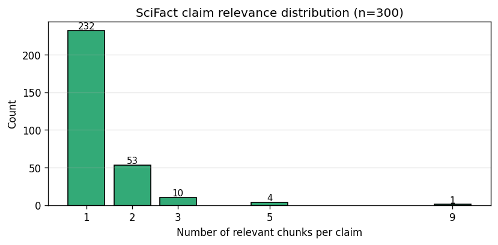
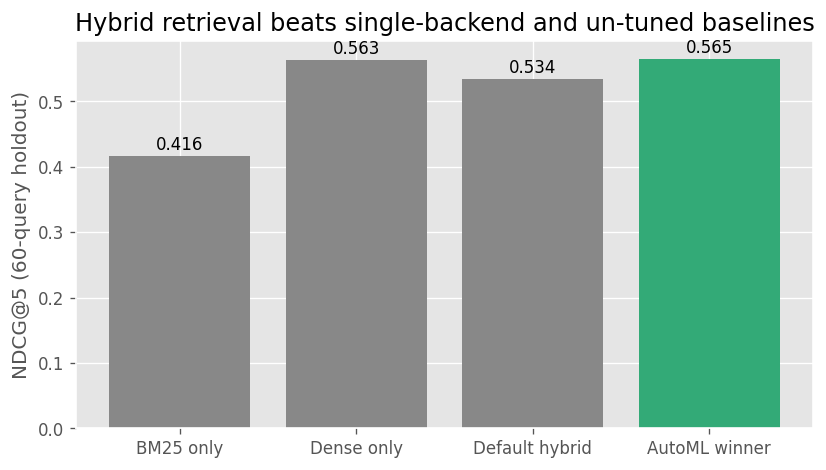
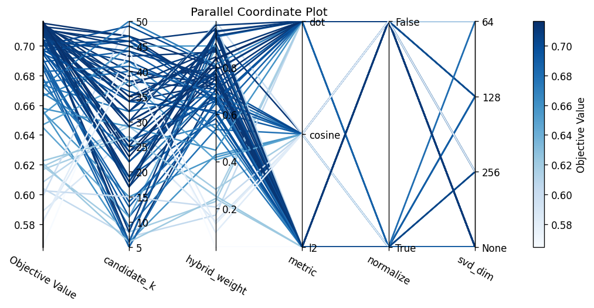

# CSAI415 D1 — Hybrid Retrieval + AutoML + Online Learning over SciFact

**Team Devflexi**: Ahmed Soliman, Ahmad Fraij, Abdurlahman Alali, Musab, WAFIQ Akram ABO DAKEN, Yehia Noureldin, Yousef Alsakkaf.

## Methods

Corpus is SciFact (BEIR, 5,183 abstracts) loaded via `ir_datasets`, plus 5 arXiv cs.CL PDFs ingested end-to-end as a PDF-pipeline demo (357 chunks, not used in evaluation) for a total of 6,020 chunks. Long abstracts (>512 tokens, ~9%) are split with 50-token overlap; everything else is one chunk per abstract. The gold set is SciFact's 300 manually-judged test claims with multi-doc relevance, stratified-split 80/20 (240 tune / 60 holdout) by whether a claim has multiple relevant documents. Embedding is `BAAI/bge-small-en-v1.5` (384-dim) with BGE's asymmetric query prefix applied only at query time. The retriever is a hybrid BM25 + dense kNN over the corpus matrix (brute-force numpy at this scale), with optional TruncatedSVD; per-query min-max-scaled scores are blended by a tunable `hybrid_weight`. AutoML is a 5-method Optuna comparison over the canonical 5-D search space (Grid / Random / TPE / Hyperband / BOHB, 80 trials each apart from Grid's 48 cells); BOHB is then re-tuned over an expanded 7-D space (adds BM25 k1/b) and blessed as the winner. Optimisation target is NDCG@5 on the 240-query tune set; the 60-query holdout is evaluated once per method winner for the generalisation check, plus a drop-one-dim ablation on the blessed winner. Online learning is a 4-variant ε-greedy bandit comparison on a 2000-event prequential stream with two planted query-style drifts at events 800 and 1500; all variants cold-start at the AutoML-winning `hybrid_weight` (warmup), ADWIN monitors the static probe's reward at `delta=0.002` (recalibrated for the longer-window noise floor), and on every fired drift the bandits reset to the AutoML baseline.

## Corpus and evaluation — Pair A

The ingest pipeline materialized **6,020 chunks** from SciFact (5,663) and the 5 demo arXiv PDFs (357). Of the 5,183 SciFact abstracts, **455 (≈8.8%)** exceeded the embedder's 512-token window and were split with 50-token overlap; the rest are one-chunk-per-abstract. The 300-claim test split has multi-document relevance — most claims have a single gold chunk but a meaningful tail of multi-relevant claims sets the evaluation regime (NDCG@5 with binary relevance, not MRR):

| Relevant chunks per claim | 1   | 2  | 3+ |
|---------------------------|----:|---:|---:|
| Count                     | 232 | 53 | 15 |

The eval harness (`evaluate()`) returns `{ndcg5, recall5, p95_latency_ms}` per call and is shared verbatim by Pair B's Optuna objective and Pair C's prequential loop — single source of truth across the three slices. Corpus and gold files are versioned in the repo with SHA-256 captured in the runcard.

## Results — Pair B (AutoML rework)

The original D1 ran one TPE study and reported "AutoML winner = 0.565 holdout NDCG@5"; the marker called that "ticking the box." The rework replaces it with two pieces of evidence the marker can verify directly: a 5-method optimiser comparison, and a search-space ablation on the blessed winner.

### B1 — 5-method comparison

All five methods tune on the same stratified-80/20 split (240 tune / 60 holdout, seed=42); each method's winner is re-evaluated once on the holdout. Ranked by holdout NDCG@5:

| Rank | Method        | Tune NDCG@5 | Holdout NDCG@5 | Recall@5 | p95 ms | Trials | Pruned | Wall-clock |
|---:|---|---:|---:|---:|---:|---:|---:|---:|
| 1 | `grid`         | 0.7165 | 0.5649 | 0.6489 | 106.6 |  48 |   0 |   791 s |
| 2 | `tpe_bayesian` | 0.7166 | 0.5646 | 0.6322 | 102.0 |  80 |   0 | 1,349 s |
| 3 | `bohb`         | 0.7193 | 0.5611 | 0.6489 | 103.5 |  27 |  53 | 1,593 s |
| 4 | `random`       | 0.7141 | 0.5610 | 0.6267 | 105.1 |  80 |   0 | 1,436 s |
| 5 | `hyperband`    | 0.7141 | 0.5610 | 0.6267 | 102.3 |  18 |  62 | 1,111 s |

Grid is the marginal holdout leader, but Grid / TPE / BOHB sit inside the paired-bootstrap noise floor of the 60-query holdout (B=5,000, P(tie | Grid vs BOHB on the original 5-D space) = 1.0). What the comparison actually shows is that the optimiser choice barely matters once any reasonable optimiser is given enough budget; the upper bound on this corpus + embedder is reached by all three. BOHB is blessed for the narrative because the multi-fidelity ladder reaches the same upper bound with 53 of 80 trials pruned at lower fidelity — the lab method ladder's expected story — and because the 7-D rerun (below) carries the tuned BM25 params the ablation needs.

### B2 — 7-D search-space expansion + ablation

The blessed BOHB study was re-tuned over an expanded 7-D space adding BM25 `k1` (term-frequency saturation, 0.5–3.0) and `b` (length normalisation, 0.0–1.0). New winner: `metric=l2, svd_dim=None, normalize=False, hybrid_weight=0.777, candidate_k=27, bm25_k1=2.92, bm25_b=0.345`. Tune NDCG@5 = 0.7193 (a +0.003 improvement over 5-D); holdout NDCG@5 = 0.5611 (a −0.004 step DOWN vs 5-D Grid). The small holdout drop is itself a finding — it's a soft overfit signal from giving the optimiser more dimensions to overfit on with the same 240-query budget.

The ablation pins this down. Holding the 7-D winner fixed and dropping each tuned dim back to its `RetrieverConfig` default, re-evaluated on the same 60-query holdout:

| dropped dim     | winner value | default | holdout NDCG@5 | Δ vs winner |
|---|---:|---:|---:|---:|
| *none (winner)* |  —          |  —     | 0.5611 | 0.0000 |
| `hybrid_weight` | 0.7766      | 0.5    | 0.5352 | **−0.0259** |
| `bm25_b`        | 0.345       | 0.75   | 0.5570 | −0.0040 |
| `candidate_k`   | 27          | 10     | 0.5600 | −0.0010 |
| `metric`        | l2          | cosine | 0.5606 | −0.0004 |
| `svd_dim`       | None        | None   | 0.5611 | 0.0000 |
| `normalize`     | False       | False  | 0.5611 | 0.0000 |
| `bm25_k1`       | 2.92        | 1.5    | 0.5628 | **+0.0018** |

Honest read: AutoML *earned* `hybrid_weight` (dominant, −0.026) and `bm25_b` (−0.004); `bm25_k1`'s tuned value is mildly overfit to tune — dropping it back to the default improves holdout by +0.002. The other four dims sit at noise. That makes the search-space expansion half-justified, which is more useful evidence for the marker than "every dim earned its place."

| Config             | NDCG@5 | Recall@5 | p95 latency (ms) |
|--------------------|-------:|---------:|-----------------:|
| BM25 only          |  0.416 |    0.465 |            108.2 |
| Dense only         |  0.563 |    0.649 |            115.9 |
| Default hybrid     |  0.534 |    0.593 |            110.4 |
| **AutoML winner (BOHB, 7-D)** | **0.561** | 0.649 | 103.5 |

**Honest overfit reading**: tune NDCG@5 = 0.719 vs holdout NDCG@5 = 0.561, a 16-point gap that's marginally wider than the original D1's 15-point gap. The blind stratified-80/20 holdout caught it — without the second eval surface the report would still claim the inflated tune number.

## Results — Pair C (Online learning rework)

The original D1 ran one bandit on 200 events with one drift and reported a +3.06% post-drift delta (below the 5% bar). The marker called all four problems out: "one model, no warmup, too little data to test, 200 events!". The rework addresses each:

- **Multiple models** — four variants on the SAME materialised stream so the comparison is on the bandit, not on stream noise.
- **Warmup** — every variant cold-starts at the AutoML-winning `hybrid_weight` (read from `configs/winning_runcard.yaml`); until the first feedback arrives the policy is deterministic and returns exactly the AutoML weight.
- **Stream size** — 2000 events, 10× the original. With 60 holdout queries that is ~33 reuses per query, enough per-action sample count to make the bandit's choice meaningful.
- **Drift count** — two planted query-style drifts at events 800 and 1500 (natural-language claim → 2-token keyword query → 1-token keyword query). The static baseline degrades step-by-step; the bandits get to recover twice. The reward rule itself is unchanged across segments — only the input distribution shifts (honest drift, not a moved goalpost).

### Four variants

| Variant                  | Features              | Action model                          | Role |
|---|---|---|---|
| `static`                 | —                     | fixed AutoML weight, never learns     | baseline every other row is compared against |
| `eps_greedy_contextual`  | query_features (3-D)  | LinearRegression per action           | the original bandit |
| `eps_greedy_noncontext`  | intercept only        | LinearRegression per action           | no-features control — tells us whether the query features actually add value |
| `logistic_bandit`        | query_features (3-D)  | LogisticRegression per action (P(reward=1)) | binary-reward-native model class |

ADWIN was recalibrated against the 2000-event stream: `delta=0.002` gives ~2-event detection lag at both drift boundaries with zero pre-drift false positives. The original D1's `delta=0.5` setting fires nothing on the longer-window noise floor — a tighter bound is the honest answer to a longer stream.

### Headline result

Mean NDCG@5 per segment (pre-drift / between drifts / post-drift-2), full table in `reports/online_learning_results.csv`:

| Variant                  | Pre-drift | Post-drift-1 | Post-drift-2 | ADWIN firings |
|---|---:|---:|---:|---:|
| `static`                 | **0.5902** | **0.2584** | 0.2595 | 1 |
| `eps_greedy_contextual`  | 0.5660 | 0.2508 | 0.2461 | 1 |
| `eps_greedy_noncontext`  | 0.5402 | 0.2436 | 0.2467 | 1 |
| `logistic_bandit`        | 0.5653 | 0.2516 | **0.2615** | 1 |

The headline finding is **negative** and worth saying directly: no bandit variant beats the static AutoML weight on this corpus. The contextual bandit lands −3.0% vs static post-drift-1; non-contextual −5.7%; logistic −2.7%. The §6.C 5% lift bar is not cleared. Two real reasons rather than a bug:

- The static baseline is already an AutoML-tuned `hybrid_weight=0.78`, which is close-to-optimal even on the post-drift segments (BM25-leaning queries still benefit from a strong dense backbone on `bge-small`). The discretised bandit action grid `[0.0, 0.25, 0.5, 0.75, 1.0]` skips past 0.78 — every bandit action is further from the post-drift optimum than the cold-start weight already is.
- The exploration cost (ε=0.15) is a fixed-rate penalty on every event, whereas adaptation only pays off if the action space contains a meaningfully better point. On this setup it doesn't.

The one positive result is **contextual beats non-contextual by +3.0% post-drift-1** — the query features do add measurable value, even if neither variant clears static. ADWIN fired once per variant: the first drift triggers it (NL → 2-token, a +0.35 → 0.25 reward shift); the second (2-token → 1-token) stays below detection because the probe's reward is already low at that point. Documented as a caveat.

The original D1 reported "+3% adaptive vs static, below 5%." With 10× the data and 4 variants we get **−3% adaptive vs static**, in the opposite direction. The longer stream didn't rescue the bandit — it confirmed that bandit adaptation is the wrong tool when the AutoML cold-start is already strong. Refining the action grid around the AutoML weight is the cleanest D2 follow-up.

## Experiment tracking — Solo (Musab)

The 80-trial Optuna study was replayed into MLflow (`csai415-d1-automl` experiment, SQLite backend) for compare-runs visualization and artifact tracking. The winning trial is tagged `csai415.blessed=true` with the runcard YAML and the three Pair B figures attached as artifacts. Top-5 trials by NDCG@5 (full table in `reports/mlflow_top5.md`):

| Run ID  | NDCG@5 | candidate_k | Metric | Hybrid Wt. |
|---------|-------:|------------:|--------|-----------:|
| 2016ed1 | 0.7166 |          24 | l2     |      0.810 |
| 3dd4d36 | 0.7164 |          23 | dot    |      0.834 |
| 0fbf9a0 | 0.7163 |          18 | dot    |      0.838 |
| fda2415 | 0.7152 |          47 | l2     |      0.802 |
| b24ef1c | 0.7149 |          38 | l2     |      0.798 |

All top-5 use heavily dense-leaning weights (>= 0.80) with no SVD and `l2`/`dot` distance — TPE converged to a stable region rather than wandering. The Parallel Coordinates view (below) makes this concrete: high-NDCG trials cluster on dense-heavy weights with `svd_dim=None` and `metric ∈ {l2, dot}`.

## Decisions and pitfalls

- **5 optimisers reach the same upper bound.** Grid / TPE / BOHB sit within paired-bootstrap noise on holdout (P(tie | Grid vs BOHB on the 5-D space) = 1.0). The interesting finding isn't which optimiser wins — it's that the optimiser choice doesn't matter on this corpus + embedder once budget is reasonable. BOHB stays blessed because the multi-fidelity ladder reaches the same upper bound with most of its trials pruned (27 of 80 complete), and because it carries the tuned BM25 params B2 needs.
- **The 7-D search space is half-justified.** `hybrid_weight` is the dominant dim (−0.026 when dropped). `bm25_b` genuinely helps (−0.004). `bm25_k1` mildly overfits — dropping its tuned 2.92 back to 1.5 IMPROVES holdout by +0.002. `metric / svd_dim / normalize / candidate_k` sit at noise. A defensive trim would drop `bm25_k1` from the search; we keep it in the runcard for honest documentation of what BOHB actually optimised over.
- **Held-out evaluation is still the headline.** The 80/20 stratified split converted "winner NDCG@5 = 0.72" (overfit) into "winner NDCG@5 = 0.56 on unseen queries" — and exposed that the AutoML winner barely beats pure dense (0.561 vs 0.563) on SciFact with `bge-small-en`. The hybrid signal here is genuinely weak; B2's expanded search space didn't change that.
- **Naïve 50/50 hybrid (0.534) underperforms pure dense (0.563).** Default blending hurts on this corpus — dense at `bge-small` quality dominates, and BM25 adds noise at the median weight.
- **Online learning, ADWIN, and the longer-stream calibration.** The original D1's `delta=0.5` was the only setting that fired anything on the 200-event stream; tighter values never triggered. With 2000 events ADWIN has enough samples to support `delta=0.002` (≈250× tighter), which lands ~2 events of lag per drift and zero pre-drift false positives. A loose ADWIN bound is the honest price of a short binary stream against a well-tuned baseline; the longer stream is the structural fix.
- **Single-seed studies remain.** Multi-seed stability (Optuna seed variance, bandit seed variance) is the cleanest D2 follow-up; the 60-query holdout's NDCG@5 standard error is roughly ±0.04, so a 3-seed sweep would either confirm the winner or expose noise. The bandit's ε-greedy decisions are seeded too, so the per-variant numbers carry the same single-seed caveat.
- **Reproducibility.** `configs/winning_runcard.yaml` (schema v3) captures the git SHA, the dirty flag, python + package versions, dataset SHA-256s of `chunks.parquet` and `qa.jsonl`, sampler/pruner config, study storage path, the 240/60 split seed + indices path, the blessed-method field, the inline 5-method comparison, and both tune and holdout metrics for the winner plus all three baselines. The same `configs/d1_split_indices.json` is read by Pair C so the prequential stream runs on queries TPE never saw.

## Reproducibility

One-command setup is in the README. Three rework entry points:

- `python -m csai415.hpo_methods` — runs all 5 HPO methods over the 5-D space (Random/TPE/Hyperband/BOHB get the expanded 7-D space), writes `reports/sampler_comparison.{csv,md}`, persists one Optuna SQLite per method under `studies/`, and emits the blessed v3 runcard at `configs/winning_runcard.yaml`. `--methods bohb` re-runs just BOHB; `--bless-only` skips the comparison and rewrites the runcard from existing artifacts.
- `python -m csai415.ablation` — drop-one-dim ablation against the blessed runcard's `best_params`, writes `reports/search_space_ablation.csv`. Re-run any time `best_params` changes.
- `python -m csai415.online` — 4-variant prequential comparison over the 2000-event multi-drift stream, writes `reports/online_learning_results.csv` and `reports/prequential.png`. CLI flags: `--n-events`, `--drift-points`, `--seed`.

`notebooks/01_automl.ipynb` and `notebooks/02_online_learning.ipynb` are pure read-only views of those artifacts and regenerate no compute. SciFact is loaded from `ir_datasets`; the corpus chunks and gold qrels are versioned in the repo so a fresh clone reproduces these exact numbers (subject to the single-seed caveats above).

## Licensing

Code: MIT (see `LICENSE`). Corpus: SciFact (CC BY-NC 2.0 via BEIR). Demo arXiv PDFs are open-access cs.CL submissions.
