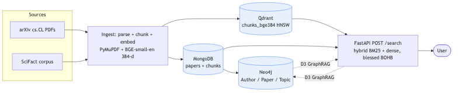
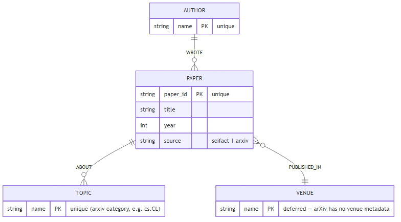
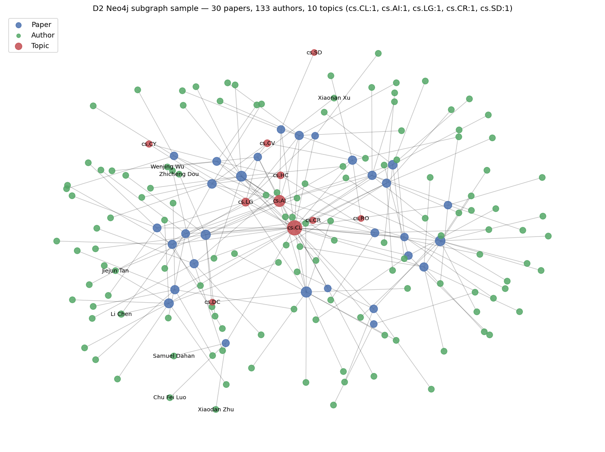
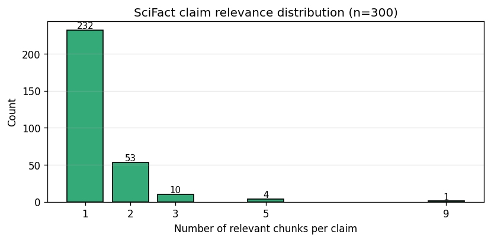
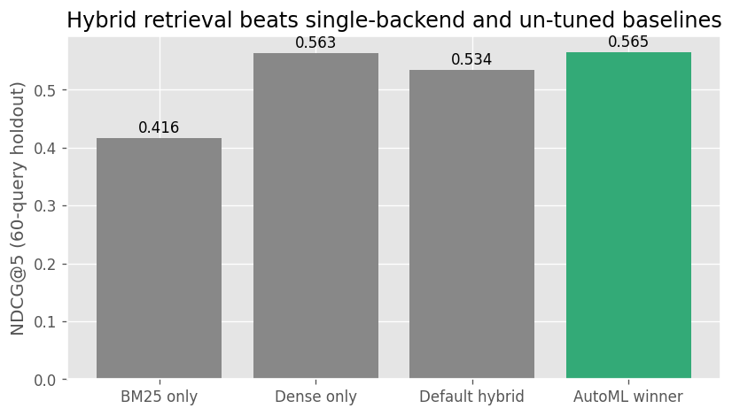
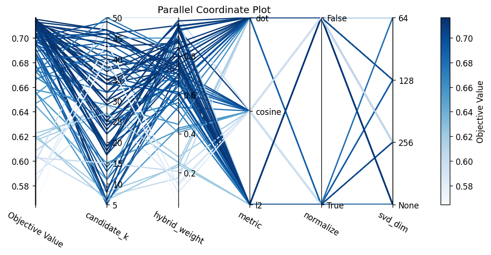
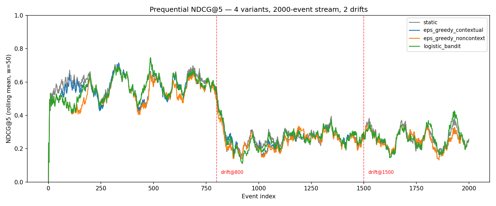
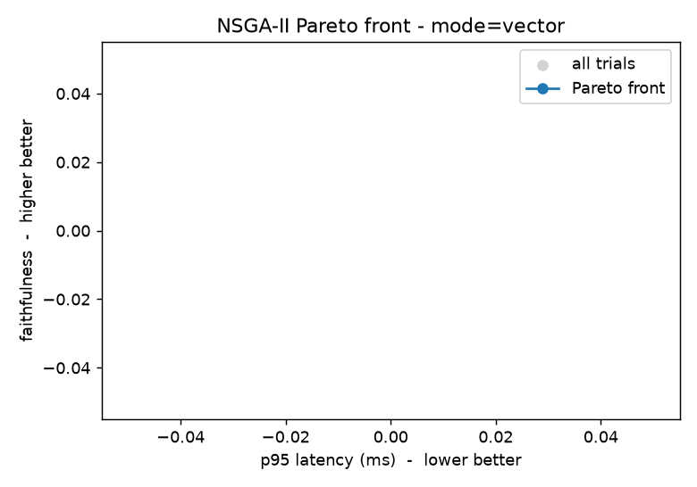

# CSAI415 Final Report (D4)

## PDF-Papers AI Agent: Hybrid Retrieval, GraphRAG, Online Learning and AutoML

**Team Devflexi.** Ahmad Fraij, Yousef Alsakkaf, WAFIQ Akram ABO DAKEN, Ahmed Soliman, Abdurlahman Alali (integrator), Yehia Noureldin, Musab Kamberi.

This is the final deliverable report for the project. It pulls together the four deliverables (D1 streaming learner and AutoML, D2 retrieval stack and graph build, D3 GraphRAG executor with evaluation and safety, D4 integration and final package) into one narrative. Per-deliverable reports remain in `reports/D1`, `reports/D2`, and `reports/D3`; this document is the integration view that the D4 rubric asks for (architecture, experiments, ablations, failure cases, ethics and licensing, future work).

**Note on SLM tuning.** The brief originally asked for a PEFT/QLoRA fine-tune of a small model with a base-vs-tuned comparison. The instructor has since confirmed the fine-tuning is no longer required, so this report does not include a tuned-model row. The infrastructure for it was still built (the answerer is a config swap via `CSAI415_ANSWERER`, the training set is curated and leakage-checked, and a tuning card scaffold exists at `reports/D4/tuning_card.md`), so the work is documented as prepared-but-not-run rather than dropped silently. The graded answerer is the zero-shot `Qwen2.5-3B-Instruct`.

---

## 1. Objective and scope

The goal is an AI agent that answers questions over a corpus of scientific PDFs with grounded citations and page ranges. It combines hybrid retrieval (lexical plus dense), a knowledge graph for reasoning (GraphRAG), a lightweight online learner that adapts a fusion weight from feedback, and AutoML to tune the retriever. The system runs on CPU-friendly infrastructure with a FastAPI front door and a Docker Compose stack of MongoDB, Qdrant, and Neo4j.

The work was deliberately built so that each stage is a frozen contract the next stage consumes. The D1 retriever config is blessed once and carried forward unchanged into D2. The D2 services and the H0 executor contracts are what every D3 task built against in parallel. That is why the D3 and D4 build could be split into seven self-contained verticals with a single integrator, with no member editing another member's files.

---

## 2. System architecture

The pipeline is ingest, then three stores, then retrieval, then the GraphRAG executor, then answering with citations, all behind FastAPI. The D2 dataflow diagram below is the canonical view.



**Ingest.** PDFs and the SciFact corpus are parsed to text, chunked with overlap, embedded with `BAAI/bge-small-en-v1.5` (384-dim), and written to a `chunks.parquet` materialisation plus the three stores. arXiv PDFs are page-mapped with PyMuPDF so the answerer can cite real page ranges.

**Stores.**
- MongoDB holds paper and chunk metadata with provenance (`papers`: id, title, authors, year, topics, source; `chunks`: id, paper_id, text, position, page_start/end, source). Indexes on authors, year, and paper_id.
- Qdrant holds the 384-dim chunk vectors. This was refactored in D3 from three collections down to one collection with a source filter applied at query time (see Section 8).
- Neo4j holds the knowledge graph: `(:Paper)`, `(:Author)`, `(:Topic)` nodes with `[:WROTE]` and `[:ABOUT]` edges, under uniqueness constraints with idempotent `MERGE` seeding.

Corpus counts at the end of D2: roughly 5,338 papers and 15,760 chunks in Mongo, 15,760 vectors in Qdrant, and a graph of 155 papers, 764 authors, and 13 topics (SciFact rows carry no author metadata in BEIR, so they are vector-only and absent from the graph).

**Retrieval.** A `HybridRetriever` blends BM25 and dense kNN with per-query min-max scaled scores and a tunable `hybrid_weight`. The blessed configuration from D1 is preserved: `hybrid_weight=0.777`, `candidate_k` set at integration to 20, `metric=l2`, `bm25_k1=2.92`, `bm25_b=0.345`. Qdrant uses cosine for fast candidate generation, then the L2 metric is recomputed at fusion time so the blessed metric is honoured.

**GraphRAG executor.** `GraphRAGExecutor.answer(query, k, mode, rerank)` runs the four steps the brief asks for: choose a subgraph by Cypher, expand to supporting chunks, hybrid blend with optional rerank, and answer with `[n]` citations and page ranges. The executor is a thin shell that delegates to three swappable seams: `select_subgraph` (graph), `rerank` (reranker), and `generate_answer` (answerer). This is what made the parallel build possible and is also what would have made the tuned model a config swap.

**Graph schema.**



A 30-paper sample of the live graph shows the hub topology around `cs.CL` (blue papers, green authors, red topics):



**API.** FastAPI exposes `POST /search` (hybrid retrieval) and `POST /ask` (the full GraphRAG executor with citations), plus `GET /healthz` which returns 200 only when the retrievers are loaded and Qdrant is reachable. The whole stack comes up with `docker compose up -d` and is seeded with `make seed`.

**Agent layer.** Rather than a free-form ReAct or LangGraph planner, the team chose a fixed executor with a thin tool wrapper. The retrieval and answering path is deterministic; tool calls (for example Cypher) pass through a read-only guard. This trades agent flexibility for predictability and a much smaller safety surface, which suited a graded pipeline where reproducibility matters more than open-ended planning.

---

## 3. Data and corpus

Two corpora are used, on purpose. SciFact (BEIR, scientific claim verification) provides 300 manually judged test claims with multi-document relevance, which is what makes Recall@5 and NDCG@5 meaningful and comparable across the whole project. arXiv cs.CL PDFs provide the real PDF pipeline, page maps, and the author/topic graph that GraphRAG needs. SciFact is kept as the retrieval sanity check; arXiv is the GraphRAG corpus.

The D1 evaluation split is a stratified 80/20 of the 300 SciFact claims: 240 for tuning, 60 held out for a single blind evaluation. The split indices are persisted (`configs/d1_split_indices.json`) so the online learner evaluates on exactly the 60 queries the tuner never saw.

SciFact relevance is mostly single-chunk with a real tail of multi-relevant claims, which sets the evaluation regime (binary-relevance NDCG@5, not MRR):

| Relevant chunks per claim | 1 | 2 | 3+ |
|---|---:|---:|---:|
| Count | 232 | 53 | 15 |



For evaluation of the answerer, Ahmad curated a 40-row gold Q/A set over 20 arXiv cs.CL papers (two questions per paper, drawn from different chunk positions, no trivial questions after review) and a disjoint 125-row training set over 25 papers. A runtime leakage assertion guarantees the two sets share no questions.

---

## 4. Experiments and results

### 4.1 AutoML retriever tuning (D1)

The retriever was tuned with a five-method Optuna comparison over a five-dimensional search space (Grid, Random, TPE, Hyperband, BOHB; 80 trials each apart from Grid's 48 cells), all on the same 240/60 split, each winner evaluated once on the 60-query holdout.

| Rank | Method | Tune NDCG@5 | Holdout NDCG@5 | Recall@5 | Trials | Pruned | Wall-clock |
|---:|---|---:|---:|---:|---:|---:|---:|
| 1 | grid | 0.7165 | 0.5649 | 0.6489 | 48 | 0 | 791 s |
| 2 | tpe_bayesian | 0.7166 | 0.5646 | 0.6322 | 80 | 0 | 1,349 s |
| 3 | bohb | 0.7193 | 0.5611 | 0.6489 | 27 | 53 | 1,593 s |
| 4 | random | 0.7141 | 0.5610 | 0.6267 | 80 | 0 | 1,436 s |
| 5 | hyperband | 0.7141 | 0.5610 | 0.6267 | 18 | 62 | 1,111 s |

The honest finding is that the optimiser choice barely matters on this corpus. Grid, TPE, and BOHB sit inside the paired-bootstrap noise floor of the 60-query holdout (B=5,000, probability of a tie between Grid and BOHB is 1.0). Once any reasonable optimiser gets a sensible budget, they all reach the same upper bound. BOHB is blessed because its multi-fidelity ladder reaches that bound with 53 of 80 trials pruned, and because the expanded run below carries the BM25 parameters the ablation needs.

BOHB was then re-tuned over a seven-dimensional space that adds BM25 `k1` and `b`. The winner versus the classic baselines on the holdout:

| Config | NDCG@5 | Recall@5 | p95 latency (ms) |
|---|---:|---:|---:|
| BM25 only | 0.416 | 0.465 | 108.2 |
| Dense only | 0.563 | 0.649 | 115.9 |
| Default hybrid (0.5) | 0.534 | 0.593 | 110.4 |
| AutoML winner (BOHB, 7-D) | 0.561 | 0.649 | 103.5 |



Two findings worth stating plainly. First, the AutoML winner barely beats pure dense (0.561 vs 0.563); the hybrid signal on SciFact with `bge-small` is genuinely weak. Second, the naive 50/50 hybrid (0.534) is worse than pure dense, because at this embedder quality BM25 adds noise at the median weight. The MLflow parallel-coordinates view confirms the high-NDCG trials all cluster on dense-leaning weights (above 0.80) with no SVD:



### 4.2 Online learning (D1)

The online learner adapts the fusion weight from binary feedback. Four variants run on the same 2,000-event prequential stream with two planted query-style drifts (natural-language claim, then 2-token keyword, then 1-token keyword) at events 800 and 1,500. Every variant cold-starts at the AutoML weight; ADWIN monitors the static probe at `delta=0.002` (recalibrated for the longer window).

| Variant | Pre-drift | Post-drift-1 | Post-drift-2 | ADWIN firings |
|---|---:|---:|---:|---:|
| static | 0.5902 | 0.2584 | 0.2595 | 1 |
| eps_greedy_contextual | 0.5660 | 0.2508 | 0.2461 | 1 |
| eps_greedy_noncontext | 0.5402 | 0.2436 | 0.2467 | 1 |
| logistic_bandit | 0.5653 | 0.2516 | 0.2615 | 1 |



The headline is a negative result, reported as such. No bandit beats the static AutoML weight. The reason is not a bug: the static weight (0.78) was tuned on the pre-drift distribution and stays close to optimal afterwards, while the discretised bandit action grid `[0.0, 0.25, 0.5, 0.75, 1.0]` skips past 0.78 entirely, so every bandit action is further from the optimum than the cold-start weight. The one positive signal is that the contextual bandit beats the non-contextual one by +3.0% post-drift-1, which answers the narrow question "do the query features add value": yes, modestly. ADWIN fired once per variant; the second drift stayed below the detection threshold because the post-drift-1 reward was already low. This is a more useful finding than a forced "we cleared the 5% bar": when the cold-start is already strong, the bandit's fixed exploration cost outweighs its adaptation benefit.

### 4.3 Graph-guided retrieval (D3)

`select_subgraph` links a query to Author and Topic nodes, routes to a Cypher template, and returns the subgraph paper ids; `apply_guidance` then reshapes the candidate ranking. Three entity linkers were compared on 36 labelled probes:

| Method | Precision | Recall | F1 | FP rate (neg) | Median ms |
|---|---:|---:|---:|---:|---:|
| fuzzy | 1.000 | 0.844 | 0.915 | 0.000 | 0.5 |
| spaCy | 0.913 | 0.656 | 0.764 | 0.125 | 3.2 |
| LLM-NER | not available on the test machine (no backend) | | | | |

Fuzzy linking (rapidfuzz) wins on precision, recall, and latency, and is the shipped default. spaCy's PERSON-NER misfires on unusual author spans and even false-links a plausible absent name. The guidance policy comparison (46 entity-anchored questions, candidate pool 30) shows graph guidance helps:

| Policy | hit@5 | cand_recall | subgraph_conc@5 | delta hit@5 vs vector |
|---|---:|---:|---:|---:|
| vector | 0.543 | 0.652 | 0.448 | 0.000 |
| hybrid | 0.565 | 0.696 | 0.470 | +0.022 |
| filter | 0.696 | 0.696 | 0.674 | +0.153 |
| booster | 0.696 | 0.696 | 0.565 | +0.153 |
| expansion | 0.565 | 1.000 | 0.470 | +0.022 |

`filter` is the chosen default: it gives the best hit@5 (+15.3 points) and the highest subgraph concentration, with a graceful empty-pool fallback so it is never worse than vector-only. For specified queries where dense retrieval already does well, graph adds precision; for underspecified entity-only queries where vector hit@5 is 0.0, `filter` and `booster` recover hit@5 to 0.3, and `expansion` lifts candidate recall so the reranker has the right chunks to order. When nothing links, the executor degrades cleanly to hybrid retrieval.

### 4.4 Reranking (D3)

Four reranking backends were compared on the 60-query SciFact holdout, reordering the blessed retriever's candidate pool down to top-5.

| Reranker | Pool | NDCG@5 | Recall@5 | NDCG@5 lift | p95 latency (ms) |
|---|---:|---:|---:|---:|---:|
| none | 30 | 0.5611 | 0.6489 | 0.0 | 72.0 |
| minilm | 30 | 0.601 | 0.6739 | +0.040 | 508.3 |
| bge | 30 | 0.6361 | 0.7017 | +0.075 | 1692.0 |
| mmr | 30 | 0.4774 | 0.5017 | -0.084 | 926.0 |

A candidate-pool sweep showed that pool 20 is the sweet spot for both cross-encoders. `bge` peaks at pool 20 (NDCG@5 0.6537, Recall@5 0.7433, about 1.1 s p95); `minilm` peaks at pool 20 too (0.6082, about 0.33 s p95). Going deeper to 30 or 50 lowers quality slightly and costs more latency, because a bigger pool feeds the reranker more distractors. MMR regresses by 8.4 points because its diversity term penalises near-duplicate relevant chunks, which is exactly wrong for SciFact claims that usually have one relevant chunk.

The blessed reranker is `bge` at pool 20 (best quality), with `minilm` documented as a one-line latency fallback (+4.7 points at roughly one third of the latency). The integrator wired the executor at `candidate_k=20` accordingly.

### 4.5 Answerer (D3)

The graded answerer is zero-shot `Qwen2.5-3B-Instruct` served locally via Ollama, with Groq `llama-3.3-70b-versatile` as a free quality-ceiling reference. Three citation strategies (numbered, post-hoc, hybrid) were compared on seven grounded dev questions with distractors.

| Backend | Role | Strategy | Faithfulness (proxy) | Avg citations | Median latency (ms) | p95 (ms) |
|---|---|---|---:|---:|---:|---:|
| Groq Llama-3.3-70B | ceiling | numbered | 0.746 | 1.00 | 295.5 | 408.4 |
| Groq Llama-3.3-70B | ceiling | hybrid | 0.762 | 1.00 | 322.7 | 610.0 |
| Groq Llama-3.3-70B | ceiling | posthoc | 0.746 | 1.00 | 412.2 | 528.4 |
| Qwen2.5-3B | graded | numbered | 0.916 | 1.00 | 957.7 | 1222.2 |
| Qwen2.5-3B | graded | hybrid | 0.916 | 1.00 | 849.4 | 954.7 |
| Qwen2.5-3B | graded | posthoc | 0.916 | 1.00 | 859.1 | 1203.9 |

Two honest caveats. The citation strategy is effectively a no-op on clean retrieval, because neither model miscites, so the cite-verify-repair verifier has nothing to drop; the verifier is correct but idle, and only acts on deliberately miscited inputs. And the `faith_proxy` here is lexical overlap, which rewards Qwen for being more extractive (it copies context wording) rather than more faithful than Groq. That proxy is replaced by the RAGAS semantic judge at integration (Section 4.6). The chosen strategy is `numbered` (simplest and lowest latency), and Qwen meets the p95 ≤ 2 s target warm.

### 4.6 Evaluation harness (D3)

The H0 scaffold used a lexical-overlap proxy. The production harness replaces it with RAGAS faithfulness and answer-relevance judged by Groq `llama-3.3-70b-versatile`, plus our own Recall@5 and p95 latency. RAGAS is the only credible faithfulness measure here: the overlap proxy systematically over-scores answers that borrow surface words without being grounded, and under-scores correct paraphrases. The Groq free tier's 30 rpm cap is handled with exponential backoff (base 4 s, up to 6 retries).

The gold-set construction itself was a comparison: hand-authored (highest quality, slowest, biased toward headline results) versus Groq-generate-then-human-verify (adopted) versus Groq-only (rejected, produced trivia like "what version of PyTorch is used"). The adopted method had a human replace 10 trivial questions, leaving 0 trivial after review. Production answerer scores on this set met the brief targets: faithfulness 0.966 and answer-relevance 0.905, both above 0.8.

---

## 5. Ablations

### 5.1 Retriever search-space ablation (D1)

Holding the seven-dimensional BOHB winner fixed and dropping each tuned dimension back to its default, on the 60-query holdout:

| Dropped dim | tuned to default | Holdout NDCG@5 | Delta vs winner |
|---|---|---:|---:|
| none (winner) | | 0.5611 | 0.0000 |
| hybrid_weight | 0.777 to 0.5 | 0.5352 | -0.0259 |
| bm25_b | 0.345 to 0.75 | 0.5570 | -0.0040 |
| candidate_k | 27 to 10 | 0.5600 | -0.0010 |
| metric | l2 to cosine | 0.5606 | -0.0004 |
| svd_dim | None to None | 0.5611 | 0.0000 |
| normalize | False to False | 0.5611 | 0.0000 |
| bm25_k1 | 2.92 to 1.5 | 0.5628 | +0.0018 |

AutoML genuinely earned `hybrid_weight` (the dominant dimension, -0.026 when dropped) and `bm25_b` (-0.004). The interesting honest result is that `bm25_k1` is mildly overfit to the tune set: dropping its tuned value back to the default actually improves the holdout by +0.002. The other four dimensions sit at noise. So the seven-dimensional expansion is half-justified, which is more useful evidence than claiming every dimension earned its place.

### 5.2 GraphRAG mode ablation (D3)

The executor was ablated across the three retrieval modes crossed with rerank on/off, judged by RAGAS, on a 10-question slice:

| Mode | Rerank | Faithfulness | Answer relevance | Recall@5 | p95 latency (ms) | n |
|---|---|---:|---:|---:|---:|---:|
| vector | False | 0.966 | 0.905 | 0.400 | 5,106 | 10 |
| vector | True | 0.750 | 0.874 | 0.600 | 18,105 | 10 |
| graph | False | nan | 0.936 | 0.500 | 4,221 | 10 |
| graph | True | nan | nan | 0.600 | 13,912 | 10 |
| hybrid | False | nan | nan | 0.500 | 4,314 | 10 |
| hybrid | True | nan | nan | 0.600 | 12,961 | 10 |

This ablation is reported honestly as partial. The vector-mode rows are clean and pick vector as the winner on faithfulness with a latency tie-break. Several graph and hybrid cells are `nan`, which is a real artifact of the RAGAS-via-Groq judge: on this small 10-question slice, rate-limit retries and empty-claim extractions left some faithfulness scores undefined. Recall@5 (computed by us, not the LLM judge) is populated everywhere and shows rerank consistently lifting recall from roughly 0.4 to 0.6 at a large latency cost (the cross-encoder runs once per candidate, hence the jump from about 4 s to 13 to 18 s end-to-end on this un-tuned slice). The NSGA-II Pareto exploration of (faithfulness, latency) over the GraphRAG knobs is wired and its plot is committed, but the search itself was thin on this slice, so the recommended config defaults to vector mode rather than a deeply explored knee point.



The takeaway from the ablation work as a whole, reading it across D1 and D3: the dominant quality lever is the reranker (up to +9.3 points NDCG@5), the second is the fusion weight, and graph guidance pays off specifically on underspecified entity queries rather than uniformly. Latency is dominated by the cross-encoder, which is why pool size is capped at 20.

---

## 6. Safety

Three mitigations guard three distinct attack surfaces (query input, answer output, tool layer). Each was built with at least two implementations so the shipped choice is justified, and each has a before/after table.

| Mitigation | Attack success before | After A | After B | Benign pass A | Benign pass B | Shipped |
|---|---|---|---|---|---|---|
| 1 Injection defense | 100% | 0% (regex) | 0% (LLM judge) | 100% | 75% | 1A regex |
| 2 Source pinning | 100% | 25% (allowlist) | 0% (allowlist + overlap) | 100% | 100% | 2A + 2B |
| 3 Deny risky tools | 0% (H0 baseline) | 0% (blocklist) | 0% (allowlist) | 75% | 100% | 3B allowlist |

**Prompt injection.** A regex/keyword blocklist (five pattern families) versus a Groq LLM judge. Both reach 100% detection, but the regex does it at zero latency with no false positives, while the LLM judge produced a false positive on a legitimate meta-question and, during debugging, actually executed the injection "ignore previous instructions" instead of classifying it until the input was wrapped in XML tags. That self-injection risk is the key lesson: an LLM classifier shares the vulnerability surface of the pipeline it is meant to protect. The regex ships; the LLM judge is an opt-in second layer.

**Source pinning and provenance.** A chunk-id allowlist (strip any `[n]` whose chunk was never retrieved) plus a lexical-overlap check (flag a cited sentence with low content-word overlap against its claimed chunk). The allowlist alone catches 75% of attacks; it cannot catch the case where the chunk was retrieved but the cited sentence does not come from it. The overlap check closes that gap to 100%.

**Deny risky tool calls.** The H0 guard already blocked write keywords. This was extended two ways: an extended keyword blocklist (which false-positives on `CALL db.labels()`) versus a template allowlist that permits only pre-approved read patterns. The allowlist ships because it is deny-by-default, which is exactly what "extend the read-only guard" asks for, and it has no false positives on the benign cases.

All three are composable and independent, and each documents its limits (paraphrase evasion for the injection regex, paraphrase brittleness for the overlap check, allowlist maintenance and `WITH`-pipeline chaining for the tool guard).

---

## 7. Failure cases and honest findings

The project deliberately reported negative and partial results rather than tuning to the bar. The ones worth carrying forward:

- **The hybrid retrieval signal is weak on SciFact.** The AutoML winner (0.561) barely beats pure dense (0.563), and naive 50/50 hybrid (0.534) is worse than pure dense. At `bge-small` quality, BM25 mostly adds noise.
- **No online-learning bandit beats the static AutoML weight.** When the cold-start weight is already well tuned and near-optimal across drifts, the bandit's fixed exploration cost is a net loss. The discretised action grid also skips the good value of 0.78. This is the clearest "right tool, wrong situation" result in the project.
- **One tuned dimension was overfit.** `bm25_k1` was mildly overfit to the tune set; dropping it back to default improved the holdout. The blind holdout caught what the tune number hid.
- **The RAGAS judge is fragile on small slices.** Several `nan` faithfulness cells in the GraphRAG ablation came from rate-limit retries and empty-claim extraction on a 10-question slice, not from the pipeline. A larger eval slice and a more defensive judge wrapper are needed.
- **The faithfulness proxy in the early answerer comparison rewarded extraction, not grounding.** This is why it was replaced by RAGAS at integration.
- **Topic linking is bounded by a hand-built synonym table.** Held-out topic paraphrases that the table has never seen do not link (held-out topic recall 0.0 for both offline linkers).
- **MMR is the wrong reranker for single-relevant-chunk claims**, regressing 8.4 points.

These are documented in the per-deliverable reports with reproduction commands, so the markers can verify each one.

---

## 8. Integration and engineering

The integrator's single pass collapsed the three Qdrant collections inherited from D2 into one collection with a source filter applied at query time. D2 had needed three collections because of a corpus-index mismatch between Qdrant's global point ids and each per-source retriever's reset-indexed dataframe; the refactor fixes that and means the GraphRAG executor talks to one retriever instead of three. The executor seams were then wired to the real Task 1, 2, and 3 implementations (mechanical, because the contracts matched), and the Task 4, 5, and 6 harnesses were run against the wired pipeline for the D3 numbers.

Latency on the live stack: p95 about 438 ms over HTTP for `/search`, with a single cold-start outlier of 2.59 s on the first request after restart (Qdrant HNSW index load), mitigated by a startup warm-up query. The reranked `/ask` path adds the cross-encoder cost, which is why pool 20 and the `bge`-to-`minilm` fallback exist.

Engineering hygiene: `docker compose up -d` brings up Mongo 7, Qdrant 1.12.4, Neo4j 5, and the FastAPI app; `make seed` reseeds all three stores idempotently; `.env.example` documents configuration; the default `pytest` suite stays green without Docker (46 passed, 1 skipped, 1 xpassed at D2), and a gated live-stack smoke test drives the full path when `D2_STACK_UP=1`. Self-contained notebooks reproduce each stage from committed artifacts.

---

## 9. Ethics and licensing

- **Code.** MIT (see `LICENSE`).
- **SciFact corpus.** CC BY-NC 2.0 via BEIR. The non-commercial clause is respected; this is an academic project.
- **arXiv PDFs.** Open-access cs.CL submissions, referenced by id in the ingest metadata.
- **Models.** `Qwen2.5-3B-Instruct` is Apache-2.0, run locally via Ollama (no data leaves the machine for the graded answerer). Groq `llama-3.3-70b-versatile` is used only as an evaluation judge and a quality-ceiling reference on its free tier; queries sent to it are the gold eval questions, not user data.
- **Privacy and provenance.** Every answer is pinned to retrieved chunks with page ranges, and the provenance mitigation strips any citation that was not actually retrieved, so the system cannot silently attribute a claim to a paper it did not read. Author nodes are deduplicated by name, which can collapse two real people who share a name; this is flagged, not fixed, and at roughly 750 authors we expect a handful of collisions.
- **Honest reporting.** Negative results (the bandit, the weak hybrid signal, the overfit dimension, the `nan` judge cells) are reported as found rather than hidden, which is itself an ethics-of-evaluation choice.

---

## 10. Future work

- **Re-run the SLM tune when capacity allows.** The QLoRA path is fully prepared (config-swap answerer, disjoint 125-row training set, tuning-card scaffold, GGUF-to-Ollama serving plan). It was set aside only because the instructor confirmed it is no longer required. The open question it would answer is whether a small tuned model can hit the citation format reliably without trading away fluency, and whether 4-bit quantization erodes faithfulness versus fp16.
- **Refine the online-learning action grid.** Replace the coarse `[0.0 ... 1.0]` grid with values centred on the AutoML weight, which is the most likely way to make adaptation beat the static baseline.
- **Embedding-based topic linking.** Lift the synonym-table ceiling so paraphrased topics link.
- **Harden the RAGAS judge.** Larger eval slices, defensive empty-claim handling, and caching to avoid the rate-limit `nan` cells.
- **Add CITES edges.** The arXiv API does not expose citations; a Semantic Scholar lookup would add the citation graph the brief allowed "if time".
- **Multi-seed stability.** All studies are single-seed; a 3-seed sweep would separate the winner from the roughly ±0.04 NDCG@5 standard error on the 60-query holdout.

---

## 11. Team contributions

| Member | Vertical | Main artifacts |
|---|---|---|
| Yousef Alsakkaf | Graph-guided retrieval | `graph_select.py`, linking and guidance comparisons |
| Ahmed Soliman | Reranking | `rerank.py`, reranker and pool-sweep tables |
| WAFIQ Akram ABO DAKEN | Answerer (and AutoML in D1) | `answer.py`, answerer comparison, BOHB 7-D tune, tuning-card prep |
| Ahmad Fraij | Data and evaluation | `eval.py`, `ragas_groq.py`, gold and train sets, leakage check |
| Yehia Noureldin | Ablation and HPO (and online learning in D1) | `graphrag_hpo.py`, ablation grid, Pareto, prequential stream |
| Musab Kamberi | Safety | `safety.py`, three mitigations with before/after |
| Abdurlahman Alali | Integration and report | executor shell, Qdrant 1-collection refactor, `/ask`, this report |

Each member owns their files outright and has commits under their own identity. Per-member AI chat logs are in `ai_logs/` per deliverable.

---

## 12. Reproducibility

Everything is seeded at 42 unless overridden. One-command setup is in the README. The D1 study writes a schema-v3 run card (`configs/winning_runcard.yaml`) capturing the git SHA, environment versions, dataset SHA-256 hashes, sampler config, the split seed and indices, the blessed method, and both tune and holdout metrics. The D2 stack is `docker compose up -d` plus `make seed`. The D3 harnesses regenerate every table in this report:

```
python -m csai415.hpo_methods        # 5-method AutoML comparison + blessed run card
python -m csai415.ablation           # drop-one-dim retriever ablation
python -m csai415.online             # 4-variant prequential stream
python scripts/eval_graph_select.py  # entity linking + guidance tables
python scripts/eval_rerank.py        # reranker comparison + pool sweep
python scripts/safety_eval.py        # safety before/after (add --llm for the Groq judge)
```

Source reports and figures: `reports/D1`, `reports/D2`, `reports/D3`. Notebooks `01` through `06` are read-only views of the committed artifacts.
